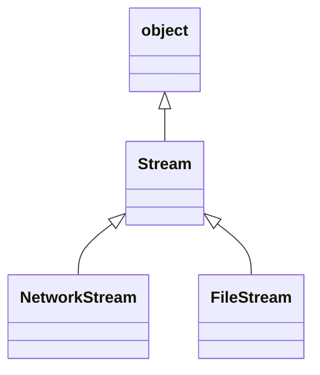
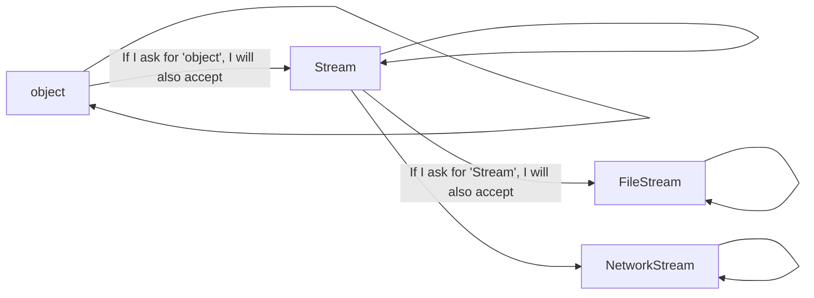
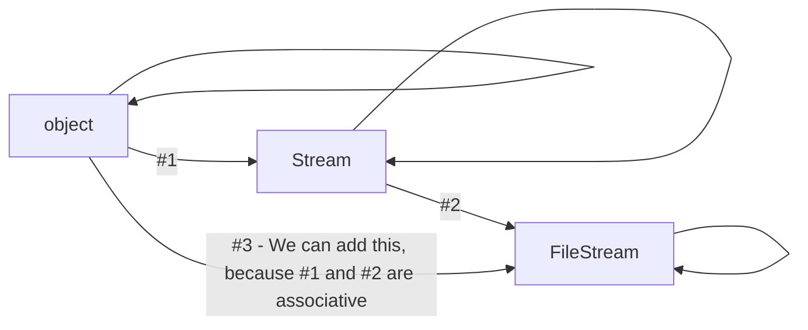

# Diagrams to Explain Variance

We'll use a simplified group of classes from the .NET BCL throughout these examples. So let's first look at a class diagram to get ourselves acquainted with the class hierarchy:



## Variance Examples
### Key to Subsequent Diagrams
The subsequent diagrams are **not** class diagrams, or any other kind of UML diagram. They are informal diagrams, to help answer the following question :  
- "If a method asks for a parameter of type T1, which of these other types (T2, T3, etc...) will it accept, and which will it not accept?"

### 1. Simple Types

We understand the simple rules of polymorphism that apply to this class hierarchy, for example from the class diagram above, we could read that "a FileStream *is a* Stream *is an* object".
So if we have a method that requires a parameter of type "Stream":

```C#
void SomeMethod(Stream s) { /* do stuff with the stream */ }
```

We know that method would accept an object of type "Stream" or "FileStream", but not an object of type "object" - and indeed the compiler gives an error if we try this:
```C#
object o = new object();
SomeMethod(o);            //error on this line
```

We can create a diagram to represent these rules around what the compiler will and will not accept as parameter types. This is similar to the class diagram above, but has some key differences.
Let's look at the diagram, then explain how to read it:



The key to reading this diagram is to follow the arrows. You can read an arrow pointing from class X to class Y as meaning: "*if a function requires a parameter of type X, it will accept a value of type Y*"

So first notice that every type on this diagram has an arrow pointing from itself, to itself. By following this arrow, you understand the obvious rule that (for example), if a method asks for a parameter of type "Stream", it will accept an object declared to be of type "Stream".

Then see which other arrows you can follow **from** the Stream type: These point to NetworkStream and FileStream. Also notice that there is no arrow pointing from Stream to object.

So we can read this diagram as stating the following rules for a method that takes a parameter of type Stream:
- It will accept an object of type Stream
- It will accept an object of type NetworkStream
- It will accept an object of type FileStream
- It will NOT accept an object of type object (as this goes **against** the direction of the arrow from object to Stream.

Note as well that these arrows are "associative" - 



So we can use a Stream - *or* a FileStream - where an object is expected.

### IEnumerable of a Simple Type

Now let's consider the rules that apply to a method that takes a parameter of type `IEnumerable<Stream>`
  

